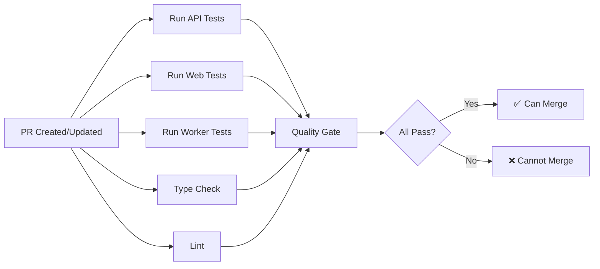

# GitHub Actions Workflows

## PR Quality Gate Workflow

This workflow ensures code quality by running comprehensive tests before allowing PRs to be merged to main/master.

### What it does

The workflow runs automatically on every pull request and includes:

1. **API Tests** - Full test suite with PostgreSQL and Redis
2. **Web Tests** - Frontend tests with coverage
3. **Worker Tests** - Background job tests
4. **Type Check** - TypeScript validation
5. **Linting** - Code style checks
6. **Coverage Check** - Ensures ≥50% coverage

### Quality Gates

✅ **All tests must pass**
✅ **Coverage must be ≥50%**
✅ **No TypeScript errors**
✅ **No linting errors**

### Workflow Steps



### Features

- **Parallel Execution** - All jobs run concurrently for speed
- **Service Containers** - PostgreSQL and Redis for integration tests
- **Smart Caching** - npm dependencies cached for faster runs
- **Coverage Upload** - Automatic upload to Codecov
- **PR Comments** - Automatic status comments on PRs
- **Concurrency Control** - Cancels outdated runs when new commits pushed

### Duration

Typical run time: **8-12 minutes**

- API Tests: ~5 minutes
- Web Tests: ~3 minutes
- Worker Tests: ~4 minutes
- Type Check: ~2 minutes
- Lint: ~1 minute

### Status Checks

The following checks must pass before merging:

1. `API Tests & Coverage` - Must pass
2. `Web Tests & Coverage` - Must pass
3. `Worker Tests & Coverage` - Must pass
4. `TypeScript Type Check` - Must pass
5. `Code Linting` - Must pass
6. `Quality Gate Check` - Must pass

## Setting Up Branch Protection

### Step 1: Enable Branch Protection

Go to: `Settings` → `Branches` → `Branch protection rules` → `Add rule`

**Branch name pattern**: `main` (or `master`)

### Step 2: Configure Protection Rules

Enable the following options:

#### Required Status Checks
✅ Require status checks to pass before merging
✅ Require branches to be up to date before merging

Select these status checks:
- `API Tests & Coverage`
- `Web Tests & Coverage`
- `Worker Tests & Coverage`
- `TypeScript Type Check`
- `Code Linting`
- `Quality Gate Check`

#### Additional Settings
✅ Require pull request reviews before merging (recommended: 1 reviewer)
✅ Dismiss stale pull request approvals when new commits are pushed
✅ Require review from Code Owners (if using CODEOWNERS file)
✅ Require linear history (optional but recommended)
✅ Include administrators (apply rules to admins too)

### Step 3: Save Protection Rules

Click "Create" or "Save changes"

## Environment Variables

The workflow uses these environment variables (automatically set in CI):

```bash
# Database (PostgreSQL service container)
DB_HOST=localhost
DB_PORT=5432
DB_USERNAME=perfana_user
DB_PASSWORD=perfana_test_password
DB_NAME=perfana_test

# Redis (Redis service container)
REDIS_HOST=localhost
REDIS_PORT=6379

# Node environment
NODE_ENV=test
CI=true
```

## Codecov Integration (Optional)

To enable coverage reports:

1. Go to [codecov.io](https://codecov.io)
2. Connect your GitHub repository
3. Add Codecov token to GitHub secrets:
   - Go to `Settings` → `Secrets and variables` → `Actions`
   - Add new secret: `CODECOV_TOKEN`

Coverage will appear on PRs automatically once configured.

## Local Testing

To run the same checks locally before pushing:

```bash
# Install dependencies
npm ci

# Run API tests
cd apps/api && npm run test:cov

# Run web tests
cd apps/web && npm test -- --coverage --ci

# Run worker tests
cd apps/worker && npm run test:coverage

# Type check
npm run type-check

# Lint
npm run lint
```

## Troubleshooting

### Tests fail in CI but pass locally

**Cause**: Different environment (Node version, missing services)

**Solution**:
- Ensure Node 20+ is used locally (not Node 18)
- Run PostgreSQL and Redis locally
- Use `CI=true` environment variable
- Check `node -v` output matches workflow version

### npm integrity errors (EINTEGRITY)

**Cause**: Corrupted package cache or transient npm registry issues during download

**Solution**:
- Workflow includes `npm cache clean --force` before install
- **Automatic retry logic** - npm ci attempts up to 3 times with 5-second delays
- If error persists after 3 attempts, check:
  - package-lock.json is committed and up-to-date
  - npm registry is accessible from GitHub Actions
  - Specific package (e.g., react-remove-scroll) isn't consistently corrupted
- In rare cases, manually re-run the workflow

### Coverage check fails

**Cause**: Coverage below 50% threshold

**Solution**:
- Add more tests to increase coverage
- Check `coverage/coverage-summary.json` for details
- Focus on untested files

### Tests timeout

**Cause**: Tests take longer in CI environment

**Solution**:
- Increase `timeout-minutes` in workflow
- Use `--maxWorkers=2` flag for Jest
- Optimize slow tests

### Service containers not connecting

**Cause**: Health checks failing or port conflicts

**Solution**:
- Check service container health in workflow logs
- Verify connection strings use `localhost`
- Ensure ports match service definitions

## Manual Workflow Triggers

To manually trigger a workflow run:

1. Go to `Actions` tab
2. Select `PR Quality Gate - Test Suite`
3. Click `Run workflow`
4. Select branch and click `Run workflow`

This is useful for:
- Testing workflow changes
- Re-running failed workflows
- Testing on non-PR branches

## Maintenance

### Updating Node.js version

**Current version: Node 20 (required by worker dependencies)**

To update to a newer version, modify all `Setup Node.js` steps:

```yaml
- name: Setup Node.js
  uses: actions/setup-node@v4
  with:
    node-version: '22'  # Update version here
```

**Note**: Node 20+ is required due to dependencies like:
- `@perfana/worker@1.0.0` (requires >=20.0.0)
- `@faker-js/faker@10.0.0` (requires ^20.19.0 || ^22.13.0)
- `joi@18.0.1` (requires >= 20)
- `undici@7.16.0` (requires >=20.18.1)

### Updating service versions

Update image tags in `services` section:

```yaml
postgres:
  image: postgres:16  # Update version

redis:
  image: redis:7.2-alpine  # Update version
```

### Adjusting coverage thresholds

Modify the coverage check scripts:

```javascript
if (total.lines.pct < 60) {  // Change 50 to 60 for stricter threshold
  console.error('❌ Coverage below 60% threshold');
  process.exit(1);
}
```

## FAQ

**Q: Can I merge without passing tests?**
A: No, with branch protection enabled. Admins can override if needed (not recommended).

**Q: How do I skip CI for documentation changes?**
A: Add `[skip ci]` to commit message (use sparingly).

**Q: Can I run only specific tests?**
A: Modify workflow to add `--testPathPattern` flag to test commands.

**Q: How long are test results kept?**
A: Artifacts are kept for 90 days by default.

**Q: Can I get Slack notifications?**
A: Yes, add a notification step using `slack-send` action.

## Support

For issues or questions:
1. Check workflow logs in Actions tab
2. Review test output artifacts
3. Check this README
4. Open an issue in the repository
