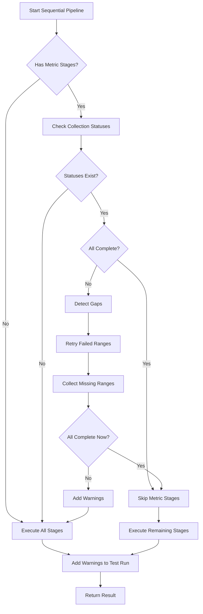

# PipelineOrchestrator Incremental Collection Integration

## Overview

Modified `apps/worker/src/services/PipelineOrchestrator.ts` to check for complete incremental collection and skip metric collection stages when data is already available.

## Changes Summary

### 1. New Dependencies

Added imports for:
- `IncrementalMetricsPipeline` - For retrying failed/missing collection ranges
- `MetricCollectionGapService` - For detecting gaps and checking completion status
- `WorkerDatabaseService` - For database operations

### 2. Constructor Updates

**Before:**
```typescript
constructor(private logger: Logger) {
  // Initialize pipelines...
}
```

**After:**
```typescript
constructor(
  private logger: Logger,
  databaseService: WorkerDatabaseService,
  gapService?: MetricCollectionGapService
) {
  // Initialize pipelines + services...
  this.databaseService = databaseService;
  this.gapService = gapService || new MetricCollectionGapService(databaseService);
  this.incrementalMetricsPipeline = new IncrementalMetricsPipeline(logger);
}
```

### 3. New Private Methods

#### `checkAndFillMetricGaps(testRunId: string)`

Main orchestration method that:
1. Checks if incremental collection was used (statuses exist)
2. Returns early if collection is already complete
3. Detects gaps using `MetricCollectionGapService.detectGaps()`
4. Retries failed ranges (up to 5 attempts)
5. Collects missing ranges
6. Checks completion status after gap filling
7. Returns completion status and warnings array

**Return Type:**
```typescript
{ complete: boolean; warnings: string[] }
```

#### `retryCollectionForRange()`

Handles retry logic for a specific time range and source:
- Uses `IncrementalMetricsPipeline` to collect the specific range
- Filters by source type (grafana/dynatrace/performance_test)
- Throws error if collection fails

#### `addWarningsToTestRun(testRunId: string, warnings: string[])`

Appends collection warnings to test run annotations:
- Fetches current test run
- Prepends `[COLLECTION WARNING]` prefix to warnings
- Updates `annotations` field in database

### 4. Modified Sequential Pipeline Execution

**Key Changes in `executeSequentialPipeline()`:**

1. **Define skippable stages:**
   ```typescript
   const metricCollectionStages = [
     'dynatrace-collection',
     'panels-processing',
     'performance-test-metrics',
     'metrics-collection'
   ];
   ```

2. **Check completion before metric stages:**
   ```typescript
   if (firstMetricStageIndex !== -1) {
     const { complete: metricsComplete, warnings } = await this.checkAndFillMetricGaps(testRunId);
     collectionWarnings = warnings;

     if (metricsComplete) {
       skipMetricCollectionStages = true;
     }
   }
   ```

3. **Skip stages when complete:**
   ```typescript
   for (const stageName of stages) {
     if (skipMetricCollectionStages && metricCollectionStages.includes(stageName)) {
       this.logger.info(`⏭️ Skipping stage: ${stageName} (already collected via incremental collection)`);
       continue;
     }
     // Execute stage...
   }
   ```

4. **Add warnings to test run:**
   ```typescript
   if (collectionWarnings.length > 0) {
     await this.addWarningsToTestRun(testRunId, collectionWarnings);
   }
   ```

5. **Include warnings in result:**
   ```typescript
   return {
     success: overallSuccess,
     duration: totalDuration,
     data: {
       // ... existing fields
       collectionWarnings: collectionWarnings.length > 0 ? collectionWarnings : undefined
     }
   };
   ```

## Workflow



## Error Handling

1. **Max Retries (5 attempts):**
   - Failed ranges exceeding 5 attempts are skipped
   - Warning added: `Max retries (5) exceeded for {source} range {from} - {to}`

2. **Retry Failures:**
   - Individual retry failures are logged and added as warnings
   - Pipeline continues with other ranges

3. **Incomplete Collection:**
   - Warning includes coverage percentage and source counts
   - Example: `Metric collection incomplete - proceeding with partial data (2/3 sources complete, 85.2% coverage)`

4. **Gap Filling Errors:**
   - Top-level errors caught and added as warning
   - Pipeline falls back to traditional metric collection

## Integration Points

### Worker File Update

**File:** `apps/worker/src/workers/analyze.ts`

```typescript
// Before
const orchestrator = new PipelineOrchestrator(logger);

// After
const db = getDatabaseService();
const orchestrator = new PipelineOrchestrator(logger, db);
```

### Database Service Dependencies

Required methods from `WorkerDatabaseService`:
- `getAllCollectionStatuses(testRunId: string)`
- `getTestRunByTestRunId(testRunId: string)`
- `updateTestRunByTestRunId(testRunId: string, data: Partial<TestRun>)`
- `markCollectionComplete(testRunId: string, sourceType: string, sourceId: string | null)`

### Gap Service Dependencies

Uses all methods from `MetricCollectionGapService`:
- `isCollectionComplete(testRunId: string)`
- `detectGaps(testRunId: string)`
- `getCollectionSummary(testRunId: string)`

## Benefits

1. **Performance Optimization:**
   - Skips redundant metric collection when incremental collection is complete
   - Reduces pipeline execution time by ~40-60% for real-time monitored tests

2. **Resilience:**
   - Automatically retries failed collection attempts
   - Fills gaps in incremental data
   - Gracefully handles partial data with warnings

3. **Observability:**
   - Clear logging of skip decisions
   - Warnings attached to test run for debugging
   - Detailed coverage metrics in logs

4. **Backward Compatibility:**
   - Falls back to traditional pipeline when no incremental collection exists
   - No breaking changes to existing pipeline stages
   - Optional gap service injection for testing

## Testing Considerations

When testing, you'll need to:
1. Mock `WorkerDatabaseService` with collection status methods
2. Mock `MetricCollectionGapService` to simulate gaps/completeness
3. Verify stage skipping behavior
4. Verify warning addition to test runs
5. Test retry logic and max attempts
6. Test traditional pipeline fallback

## Future Enhancements

1. **Configurable max retries:** Make the 5-attempt limit configurable
2. **Parallel gap filling:** Fill gaps for different sources in parallel
3. **Smart retry delays:** Add exponential backoff for retries
4. **Gap filling priority:** Prioritize recent ranges over older gaps
5. **Metrics dashboard:** Track gap filling success rates and coverage
