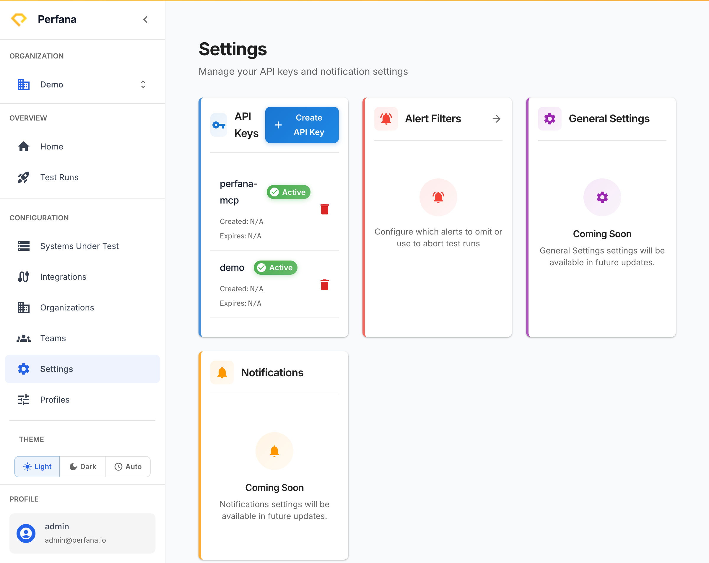

# Create an API key

Create an API key so your CI pipeline or load-test tool can authenticate to Perfana and send test runs. The key is used as a Bearer token in the requests that ingest results.

**Before you start**
- Select your active organization in the sidebar (**Configuration** group).
- Decide which organization the key should be scoped to.

**Steps**
1. In the sidebar, open **Settings**.
   The Settings hub opens with the subtitle "Manage your API keys and notification settings".
2. On the **API Keys** card, click **Create API Key**.
   A dialog opens for the new key.
   
   *Figure: the Settings page - the API Keys card.*
3. Give the key a description and **scope it to an organization**.
   The key will only authenticate for resources in that organization.
4. Create the key, then **copy the token**.
   The full token is shown only once — copy and store it securely now.
5. Use the token as a Bearer token in your CI/load-test tool when sending runs.
   Requests authenticated with the key can ingest test runs into the scoped organization.

**Result**
You have an API key that CI and load-test tools can use to send runs to Perfana. To revoke it, return to the **API Keys** card and click **Delete**.

**Troubleshooting**
- *You lost the token* — Tokens are shown only once and cannot be recovered. Delete the old key and create a new one.
- *401 Unauthorized when sending runs* — Confirm the token is sent as a Bearer token and that the key has not been deleted or expired.

**Related**
- [Send your first test run](../test-runs/send-first-run.md)
- [Manage organizations](organizations.md)
