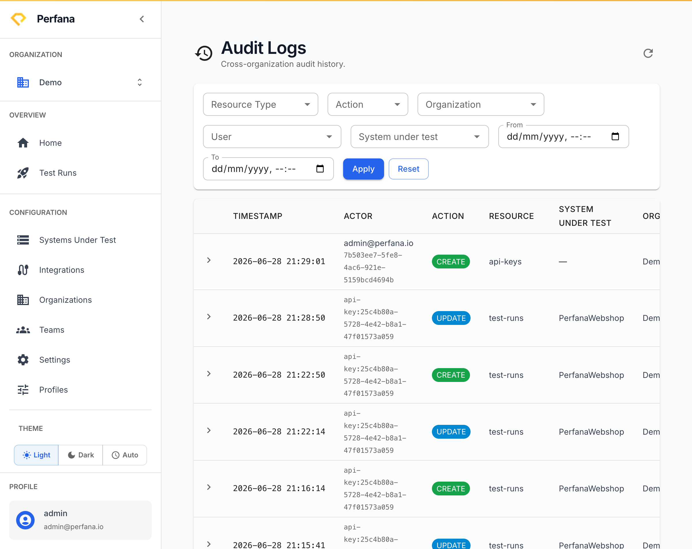

# Review audit logs

Review who changed what and when across Perfana. Use audit logs to investigate a change, confirm an action took place, or track activity for a system or organization. This page appears only if your account has audit access.

**Before you start**
- Your account must be granted audit access. If you don't have it, the **Audit Logs** entry won't appear in the navigation.

**Steps**
1. In the sidebar, open **Audit Logs**.
   The audit table opens with columns for Timestamp, Actor, Action, Resource, System under test, and Org.
   
   *Figure: the Audit Logs page - filter bar above the audit table.*
2. Set any filters you need: **Resource Type**, **Action**, **Organization**, **User**, **System under test**, and a **From**/**To** date range.
   The filters define which events you want to see.
3. Click **Apply**.
   The table refreshes to show only matching events.
4. Page through the results using the pagination controls.
   Older or newer matching events load as you page.
5. To clear all filters, click **Reset**.
   The table returns to the unfiltered view.

**Result**
You can see the audit events that match your filters. Each column tells you part of the story:
- **Timestamp** — when the event happened.
- **Actor** — the user or API key that performed the action.
- **Action** — what was done (for example create, update, delete).
- **Resource** — the resource that was affected.
- **System under test** — the system the event relates to, if any.
- **Org** — the organization the event belongs to.

**Related**
- [Manage organizations](organizations.md)
- [Create an API key](api-keys.md)
