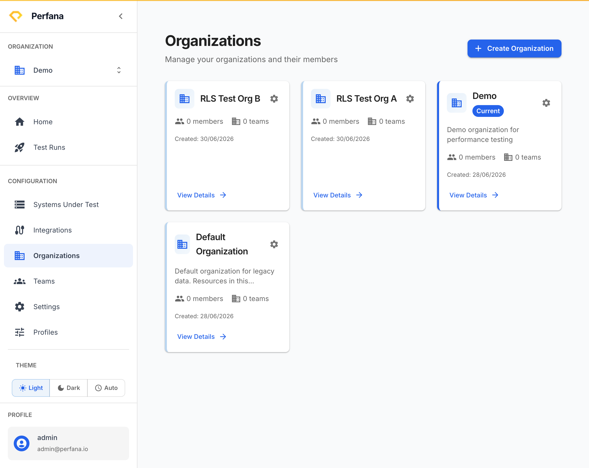
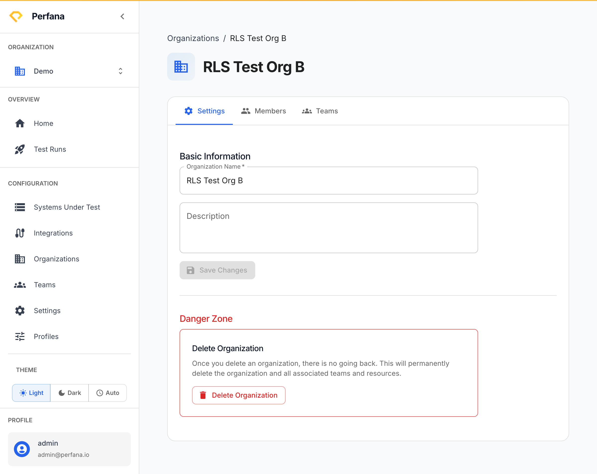

# Manage organizations

Create and manage organizations, their members, and their teams. An organization is the top tenancy boundary in Perfana — everything (systems, integrations, runs) belongs to one. This page is available to global admins only.

**Before you start**
- You must be a global admin. Non-admins won't see the **Organizations** entry in the navigation.

**Steps**
1. In the sidebar, open **Organizations** (under Settings).
   The Organizations page opens with "Manage your organizations and their members".
   
   *Figure: the Organizations page.*
2. Click **Create Organization** and enter its details.
   The new organization appears in the list.
3. Open an organization to manage it.
   The organization detail page opens with **Settings**, **Members**, and **Teams** tabs.
   
   *Figure: an organization's Settings, Members, and Teams tabs.*
4. On the **Settings** tab, edit the organization's details.
   Your changes are saved to the organization.
5. On the **Members** tab, add or remove members and set each member's role.
   Members gain access to the organization at the role you assign (org-admin, org-member, or org-viewer).
6. On the **Teams** tab, review the teams within this organization.
   Teams group systems and members inside the organization.

**Result**
The organization exists with the members and roles you set. Its members can now work with the systems and integrations that belong to it.

**Related**
- [Manage teams](teams.md)
- [Key concepts](../concepts.md)
