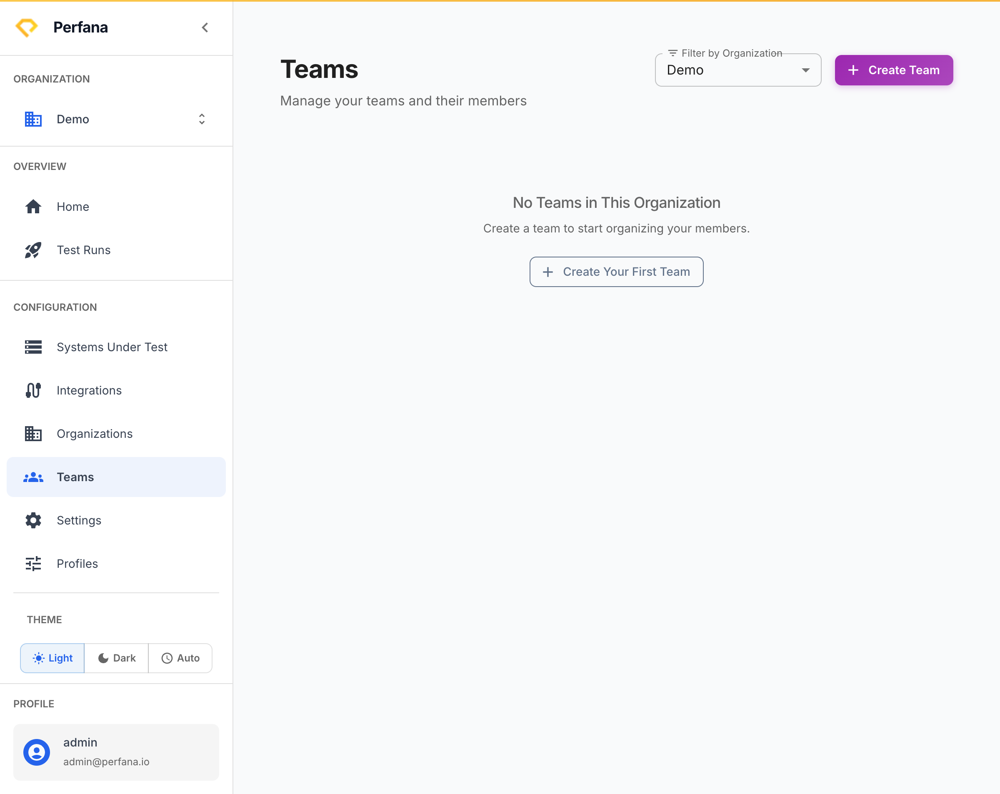

# Manage teams

Create teams, manage their members, and assign systems to them. Teams group people and systems inside an organization so the right people see the right work. This page is available to all authenticated users.

**Before you start**
- Select your active organization in the sidebar (**Configuration** group).
- Know which organization the team belongs to.

**Steps**
1. In the sidebar, open **Teams** (under Settings).
   The Teams page opens with "Manage your teams and their members".
   
   *Figure: the Teams page.*
2. Use **Filter by Organization** to narrow the list to one organization.
   The list shows only that organization's teams.
3. Click **Create Team** and enter its details.
   The new team appears in the list.
4. Open a team to manage it.
   The team detail page opens with **Settings**, **Members**, and **Systems** tabs.
5. On the **Members** tab, add or remove members and set each member's role.
   Members gain access at the role you assign (team-admin, team-member, or team-viewer).
6. On the **Systems** tab, assign systems to the team.
   The assigned systems become associated with this team.

**Result**
The team exists with its members and assigned systems. Team members can now access the systems you assigned.

**Related**
- [Manage organizations](organizations.md)
- [Add a system under test](../configuration/create-system-under-test.md)
