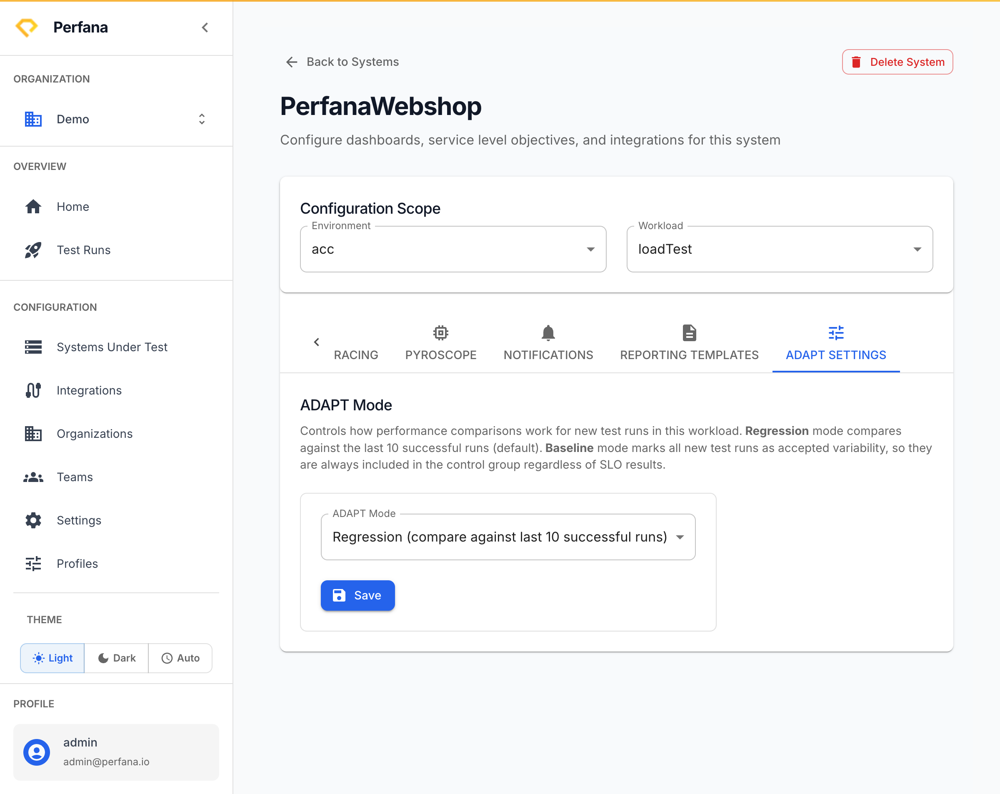

# Configure ADAPT

ADAPT is Perfana's automated regression detection. It compares each run against a baseline of similar past runs. The **ADAPT Mode** setting controls how that baseline is built, and you set it per environment and workload.

**Before you start**
- You have a [system under test](create-system-under-test.md).
- You know which environment and workload you want to configure.

**Steps**
1. Open the system from **Systems Under Test** (`/systems`) using its **Edit Config** button.
   You see the system's configuration page.

2. Open the **ADAPT Settings** tab.
   You see the **Configuration Scope** and the **ADAPT Mode** selector.
   
   *Figure: the ADAPT Settings tab - choose Regression or Baseline mode per environment and workload.*

3. Under **Configuration Scope**, choose the **Environment** and **Workload** these settings apply to.
   The mode you pick next applies only to runs that match this environment and workload.

4. Choose an **ADAPT Mode**:
   - **Regression (compare against last 10 successful runs)** — the default. Each new run is compared against the last 10 successful runs to detect regressions.
   - **Baseline** — every new run is marked as accepted variability and is always added to the control group, regardless of its SLO results. Use this when you are deliberately establishing a new baseline (for example, right after an infrastructure change).

5. Click **Save**.
   New runs of this environment and workload are analysed using the mode you chose.

**Result**
ADAPT uses the mode you selected for each new matching run. In Regression mode, runs that drift beyond the baseline are flagged as regressions. For how to read the outcome, see [Understand ADAPT results](../test-runs/understand-adapt.md).

**Troubleshooting**
- *New runs are never flagged, even when slower* — the workload may be in **Baseline** mode, which accepts every run. Switch it back to **Regression** once your new baseline is established.
- *Everything is flagged as a regression on a brand-new workload* — there aren't yet enough successful runs to form a reliable baseline. Run the test a few more times under the same conditions.

**Related**
- [Understand ADAPT results](../test-runs/understand-adapt.md)
- [Concepts](../concepts.md)
