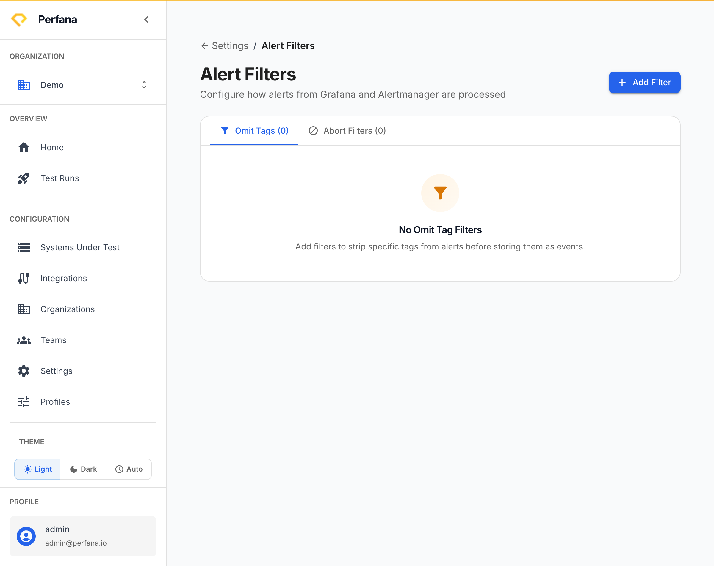
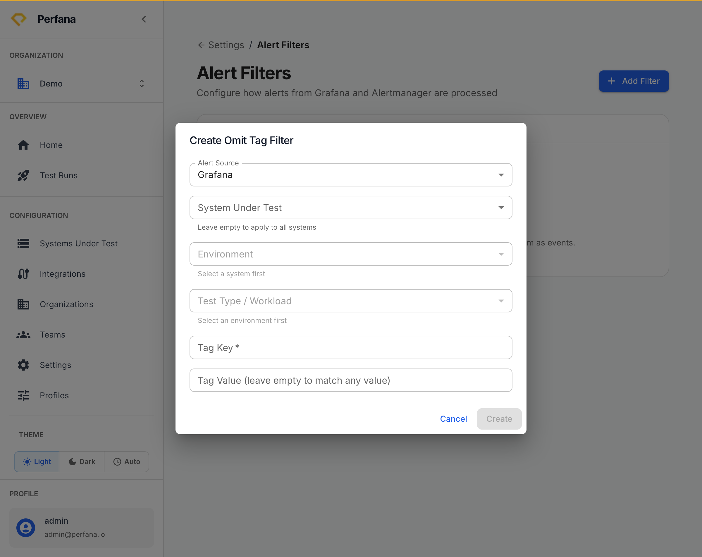

# Set up alert filters

Alert filters control which incoming alerts Perfana ignores and which can abort a test run. Set them up to silence known-noisy alerts, or to stop a run automatically when a critical alert fires.

**Before you start**
- Select your active organization in the sidebar.
- Know the alert source and the scope (system, environment, workload) the filter should apply to.

**Steps**
1. Open the **Settings** hub (`/settings`), then go to **Alert Filters** (`/settings/alert-filters`).
   You see a table of existing filters, subtitled "Configure how alerts from Grafana and Alertmanager are processed". Columns are Alert Source, System, Environment, Test Type, Tag Key, and Tag Value.
   
   *Figure: the Alert Filters page.*

2. Click **Add Filter** and choose the **Alert Source** the filter applies to.
   The **Create Omit Tag Filter** dialog opens and the scope fields become available.

3. Set the scope: choose the **system**, **environment**, and **workload** the filter should match. Narrow it further with a **tag key** and **tag value** if you only want to match alerts carrying a specific tag.
   The filter targets only alerts matching every field you set.
   
   *Figure: the alert filter form.*

4. Save the filter.
   It appears in the table and applies to matching alerts on future runs.

**Understanding the scope fields**
- **Alert Source** — which integration the alert comes from.
- **System / Environment / Test Type** — which system, environment, and workload the filter applies to. Leave a field broad to match more runs, or set it to narrow the match.
- **Tag Key / Tag Value** — match only alerts carrying this tag, for fine-grained control.

**Delete a filter**
On the filter's row, choose **Delete**. The filter is removed and no longer affects runs.

**Result**
Matching alerts are either omitted from results or used to abort a run, depending on the filter. Your runs stay focused on alerts that matter.

**Related**
- [Concepts](../concepts.md)
