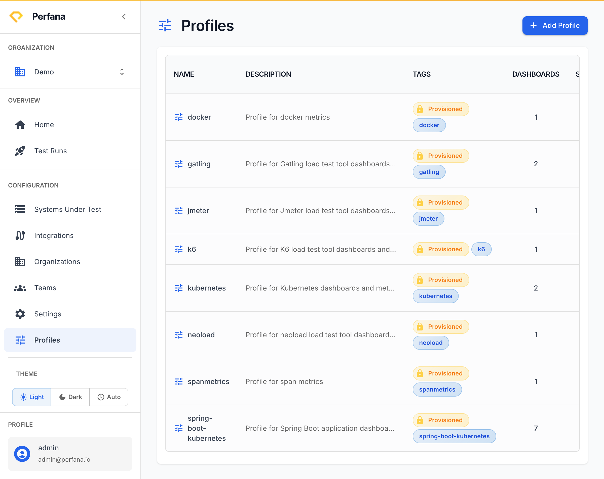
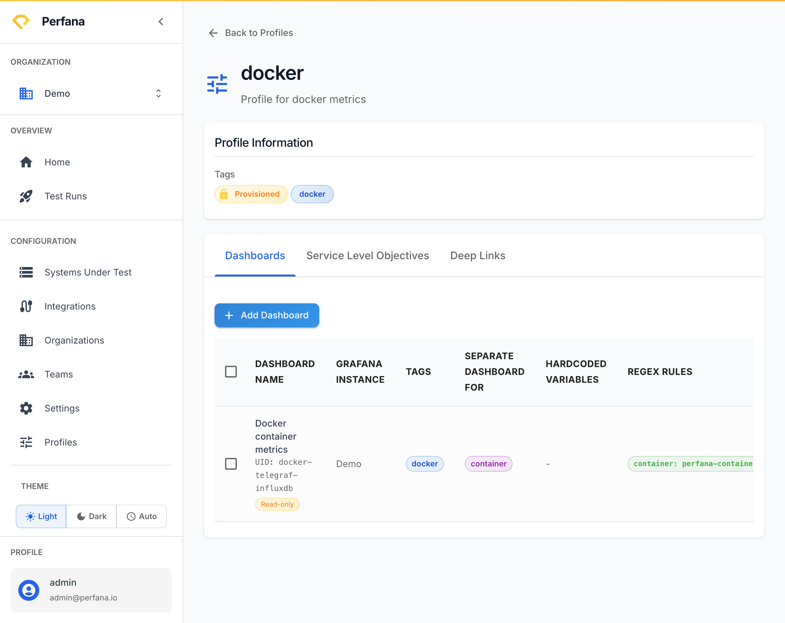

# Create a profile

A profile is a reusable bundle of dashboards and SLOs. Create one so new test runs inherit a standard set of dashboards and checks automatically, instead of you configuring each system from scratch.

**Before you start**
- Select your active organization in the sidebar.
- Know which dashboards and SLOs you want every run to inherit.

**Steps**
1. Go to **Profiles** (`/settings/profiles`).
   You see a table of existing profiles.
   
   *Figure: the Profiles list.*

2. Click **Add Profile**, then enter a **name** and **description**.
   The profile appears in the table.

3. Open the new profile to see its detail page (`/settings/profiles/[id]`).
   You see the profile's tabs: **Dashboards**, **Service Level Objectives**, and **Deep Links** (coming soon).
   
   *Figure: a profile's detail tabs.*

4. On the **Dashboards** tab, click **Add Dashboard** and add each dashboard you want runs to inherit.
   The dashboards appear in the list.

5. On the **Service Level Objectives** tab, click **Add Service Level Objective** and add each check.
   The checks appear in the list. For how thresholds and Apdex work, see [Define SLOs](define-slos.md).

**Result**
The profile holds your standard dashboards and SLOs. New test runs that use this profile inherit them automatically, so you avoid repeating the same setup on every system.

**Tip**
Profiles can also be provisioned from CI, so your standard set of dashboards and checks can be created as code.

**Related**
- [Define SLOs](define-slos.md)
- [Concepts](../concepts.md)
