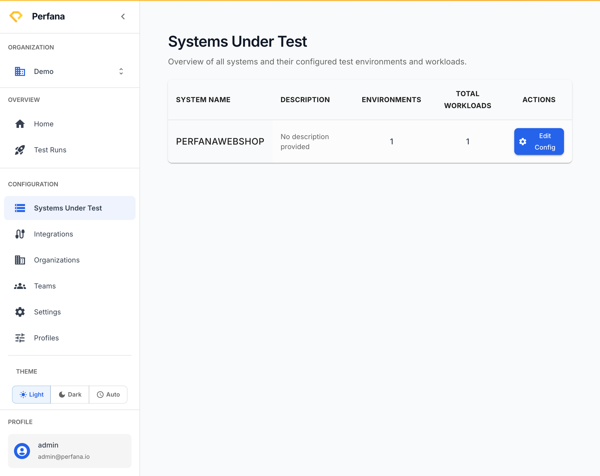
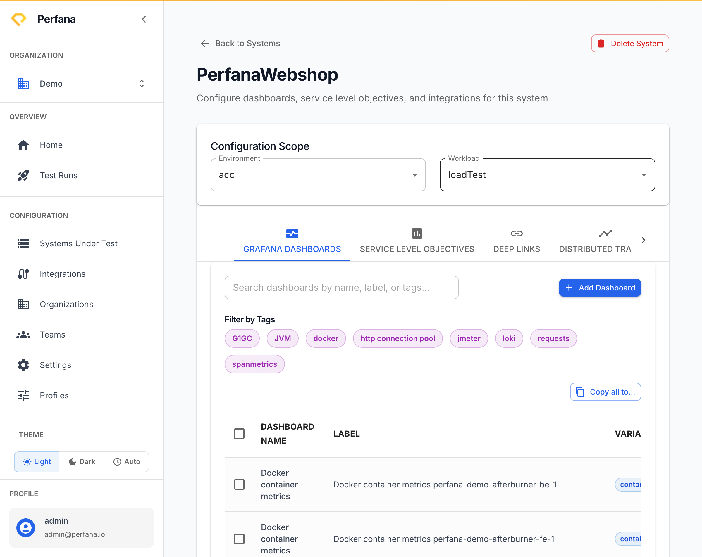

# Create a system under test

A system under test (SUT) is the application you are load-testing. It's where Perfana collects metrics, stores test runs, and holds the dashboards, SLOs, and ADAPT settings for that application.

You **don't** create a SUT in the web app. Perfana creates one automatically the first time you send a test run with a new system name. This article shows how a SUT comes into being and where you configure it afterwards.

**Before you start**
- An **API key** to send a test run. See [Create an API key](../administration/api-keys.md).
- A **name** for the system — for example `checkout-service`.

**Steps**
1. **Send a test run with a new system name.** Point your load-test tool at `POST /api/test` and set `systemUnderTest` to the name of your application. If no system with that name exists yet, Perfana creates it.
   The system now exists in Perfana. See [Send your first test run](../test-runs/send-first-run.md) for the full call.

2. Go to **Systems Under Test** (`/systems`).
   Your new system appears in the table, with columns for name, description, number of environments, and number of workloads.
   
   *Figure: the Systems Under Test list.*

3. On the system's row, click **Edit Config** to open its configuration.
   You land on the system's config page (`/systems/[id]/config`), titled with the system name.
   
   *Figure: a system's configuration tabs.*

4. Work through the configuration tabs to set up the system. Some tabs appear only once the matching integration is connected:
   - **Grafana dashboards**
   - **Service Level Objectives** — see [Define SLOs](define-slos.md)
   - **Deep Links**
   - **Dynatrace**, **Distributed Tracing**, **Pyroscope**
   - **Notifications**
   - **Reporting Templates** — see [Manage reporting templates](reporting-templates.md)
   - **ADAPT Settings** — see [Configure ADAPT](adapt-settings.md)

**Result**
The system appears in the **Systems Under Test** table and its configuration is reachable through **Edit Config**. Further test runs sent under the same system name collect metrics and produce results against it.

**CI alternative — provision explicitly**
If you'd rather create the system up front (for example, to define its environments and workloads before the first run), call the idempotent provisioning API `POST /api/systems-under-test` from your pipeline. It creates the system — optionally with its environments and workloads in one call — or returns the existing one with HTTP 409, so the script is safe to run on every build. See [Create an API key](../administration/api-keys.md) to authenticate the call.

**Related**
- [Send your first test run](../test-runs/send-first-run.md)
- [Define SLOs](define-slos.md)
- [Configure ADAPT](adapt-settings.md)
- [Manage reporting templates](reporting-templates.md)
- [Concepts](../concepts.md)
