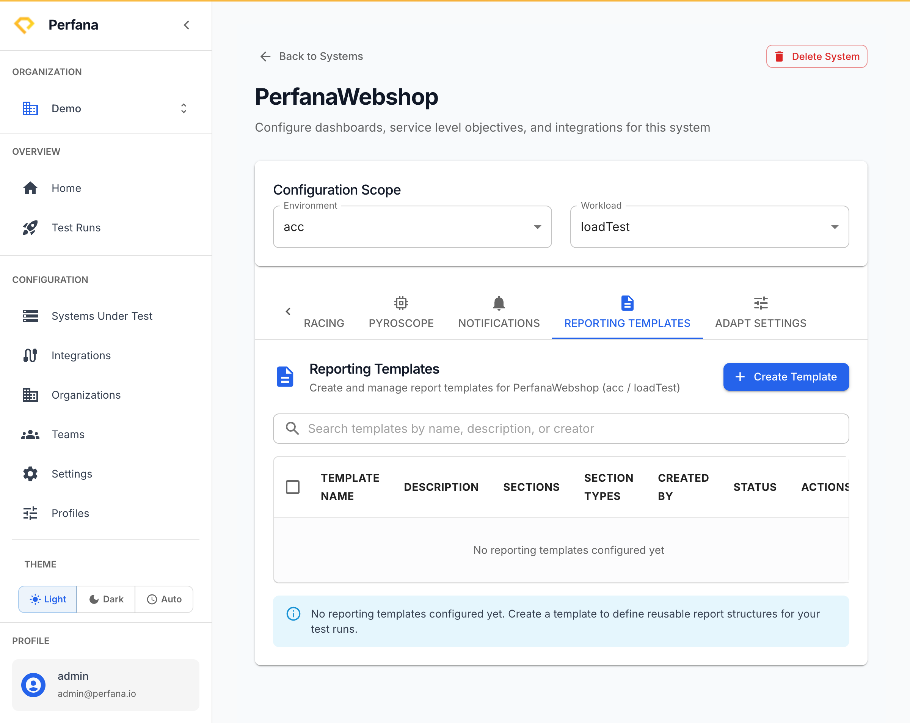

# Manage reporting templates

A reporting template defines what a generated report contains and how it is laid out. Manage templates per system so your reports follow a consistent structure every time.

**Before you start**
- You have a [system under test](create-system-under-test.md).
- The Reporting integration is connected (the **Reporting Templates** tab appears only when it is).

**Steps**
1. Open the system from **Systems Under Test** (`/systems`) using its **Edit Config** button.
   You see the system's configuration page.

2. Open the **Reporting Templates** tab.
   You see the templates already defined for this system.
   
   *Figure: the Reporting Templates tab.*

3. Create a template and configure how it shapes the report.
   The template appears in the list and can be used when generating reports.

4. To remove a template, delete it and confirm in the dialog.
   The template is removed from the list once you confirm.

**Result**
The system has one or more reporting templates. When you generate a report for a run, you can apply a template so the output follows the structure you defined — see [Generate a report](../test-runs/generate-report.md).

**Related**
- [Generate a report](../test-runs/generate-report.md)
- [Create a system under test](create-system-under-test.md)
