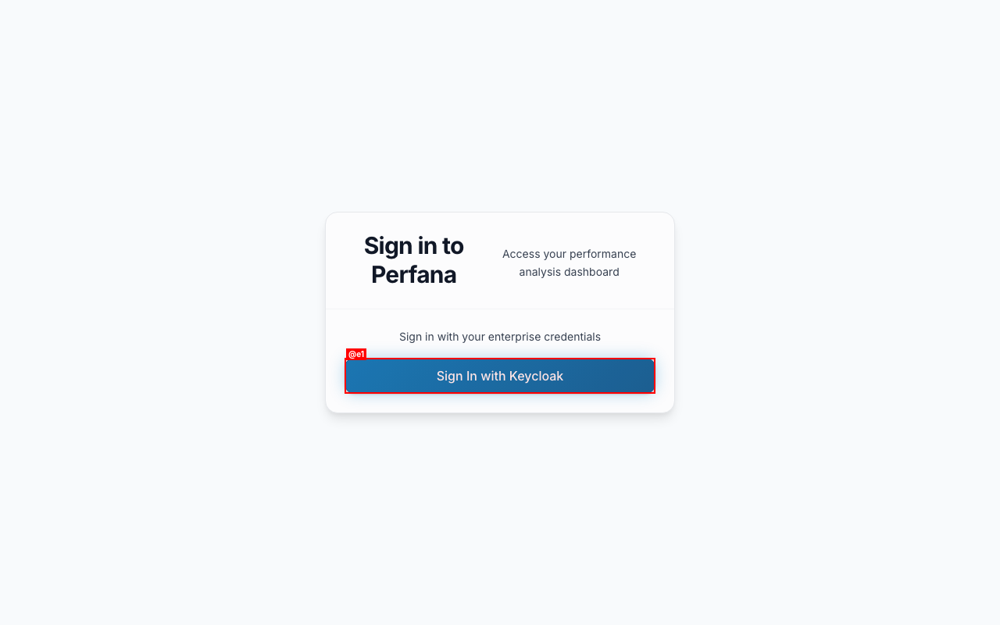
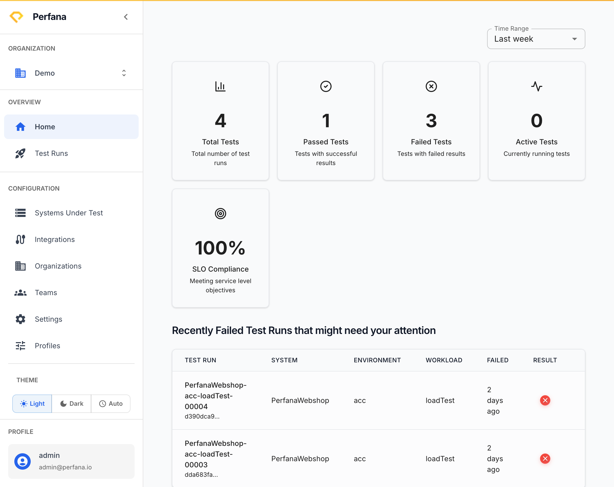

# Sign in to Perfana

Sign in to reach your dashboards, test runs, and analysis. Do this every time you start a new session.

**Before you start**
- You need a Perfana account. If your team uses single sign-on (SSO), you sign in with your normal work account.
- Have the Perfana web address ready (for local installs, http://localhost:4001).

**Steps**
1. Open Perfana in your browser. You land on the **Sign in to Perfana** screen.
   You see a **Sign In with Keycloak** button under the heading "Sign in with your enterprise credentials".
   
   *Figure: the Perfana sign-in screen.*
2. Click **Sign In with Keycloak**.
   You are taken to your organization's login page, where you enter your work credentials.
3. Enter your username and password on the Keycloak page, then confirm.
   You return to Perfana and land on the **Home** page.
   
   *Figure: the Home page after sign-in.*

**If your install doesn't use Keycloak**

Some installs are configured without Keycloak. On those, the sign-in screen shows an email and password form instead of the **Sign In with Keycloak** button. Enter your email and password, then click the sign-in button. For the demo environment, use `perfana@example.com` / `perfana`.

**Result**
You are signed in and viewing the **Home** page, with the sidebar visible on the left.

**Troubleshooting**
- *You're asked to pick an organization, or pages look empty* — most pages need an active organization. Choose one from the **Organization** selector at the top of the sidebar. If you don't belong to any organization yet, ask an administrator to add you. See [Navigate Perfana](navigating.md).
- *Login fails or loops back to the sign-in screen* — your session may have expired. Try again, and confirm you're using the correct work account for SSO.

**Related**
- [Navigate Perfana](navigating.md)
