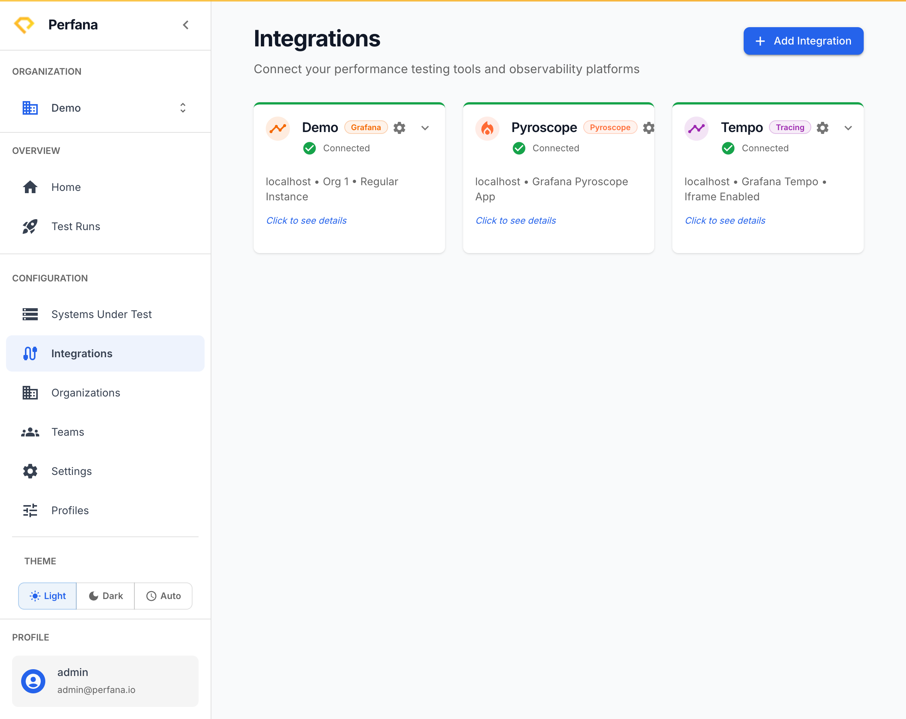
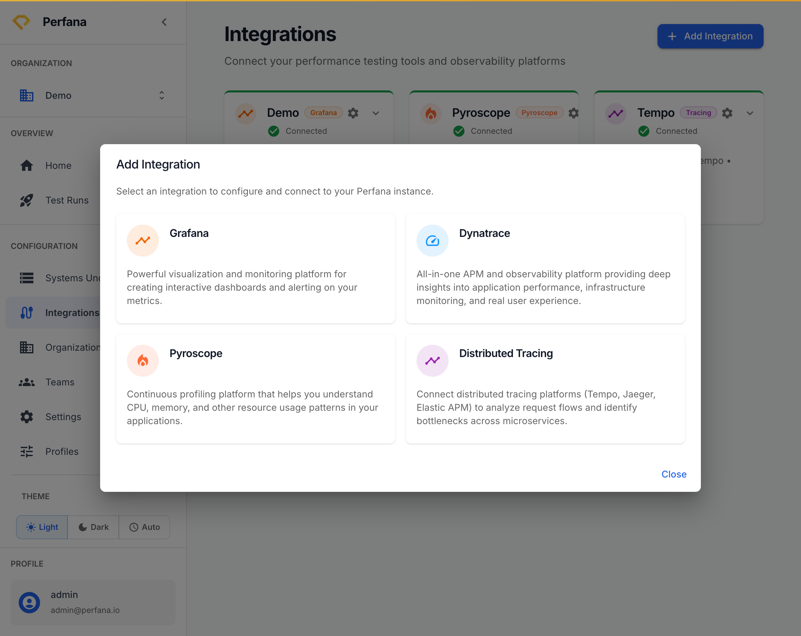

# Connect Grafana

Connect a Grafana instance so Perfana can pull dashboards, panels, and metrics for your test runs. Grafana is Perfana's main metrics source — it also reads InfluxDB and Prometheus data through Grafana data sources, so this is usually the first integration you set up.

**Before you start**
- Select your active organization in the sidebar (**Configuration** group).
- Have your Grafana base URL and an API token/key with read access to dashboards and data sources.

**Steps**
1. In the sidebar, open **Integrations**.
   The Integrations page lists your connected tools under "Connect your performance testing tools and observability platforms".
   
   *Figure: the Integrations page.*
2. Click **Add Integration**.
   A picker dialog opens listing the available integration types.
3. Choose **Grafana**, then click **Connect**.
   The Grafana connection dialog opens.
4. Enter the Grafana **base URL** (for example `https://grafana.example.com`) and your **API token/key**.
   If your Grafana uses organizations, set the **org id**. Enable snapshot support here if you use snapshot instances.
   
   *Figure: choose Grafana in the Add Integration dialog.*
5. Click **Test Connection**.
   Perfana confirms it can reach Grafana with the supplied credentials.
6. Save the integration.
   A Grafana card appears on the Integrations page with **Settings** and **Delete** actions.

**Result**
Grafana is connected at the organization level. The Grafana tab now appears on each system's configuration page, where you can pick dashboards and define SLOs per system.

**Troubleshooting**
- *Test Connection fails* — Check the base URL has no trailing path errors and that the API token has not expired or been scoped too narrowly.
- *No dashboards appear later* — Confirm the token can read the Grafana folders that contain your dashboards.

**Related**
- [Add a system under test](../configuration/create-system-under-test.md)
- [Connect Dynatrace](connect-dynatrace.md)
