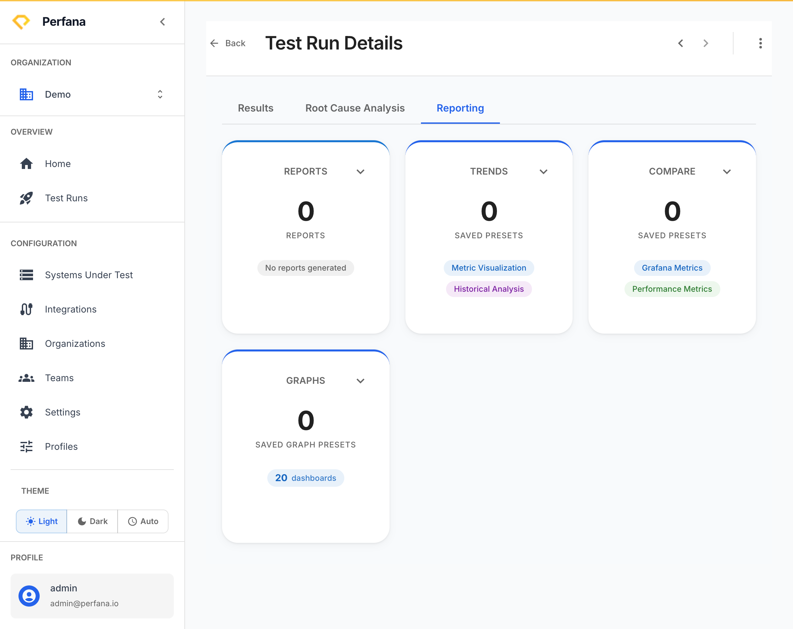

# Generate and share a report

This lets you turn a test run into a shareable HTML report and send it to people who do not log in to Perfana — stakeholders, developers, managers. Use it to communicate results after a run.

**Before you start**
- A test run to report on. Open it at `/test-runs/[id]` and go to the **Reporting** tab.

**Steps**

1. On the **Reporting** tab, find the **Report** card and click **Generate Report**.
   The generate-report dialog opens.
   
   *Figure: the Reporting tab - generate a report from the Reports card.*

2. **Confirm the report options** in the dialog and generate it.
   Perfana builds the report and opens it as an HTML report in a modal.

3. **Share the report** using its share link. The link points to `/reports/share/[shareId]`.
   Anyone with the link can open the report without signing in to Perfana.

**Result**
You have an HTML report for the run and a link you can send to others.

**What the recipient sees**
- The report opens at `/reports/share/[shareId]` with no login required.
- They can **Refresh** to pull the latest data, **Print** the report, and expand sections.
- Share links can **expire** — if a recipient reports a dead link, generate and share a fresh one.

**Troubleshooting**
- *Recipient gets "link expired" or "not found"* — the share link has expired. Generate the report again and send the new link.

**Related**
- [Customize report content](../configuration/reporting-templates.md)
- [Compare test runs](compare-runs.md)
- [Investigate root cause](root-cause-analysis.md)
