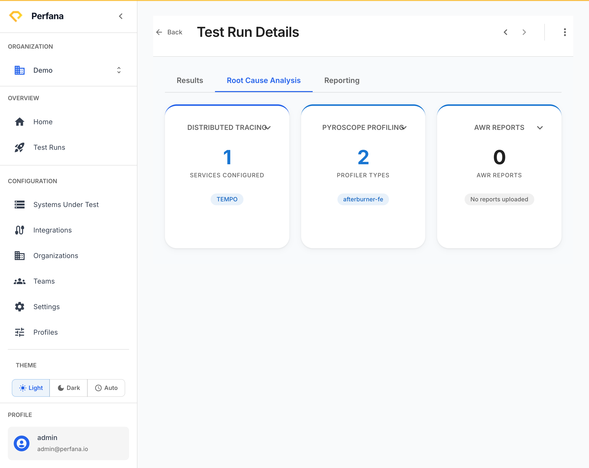

# Investigate root cause

This lets you go from "a run regressed" to "here is where it went wrong" by digging into server-side evidence for a single run. Use it after a comparison or a failed check tells you something slowed down.

**Before you start**
- A test run to investigate. Open it at `/test-runs/[id]` and go to the **Root Cause Analysis** tab.
- The relevant integration connected. Some cards only appear when their integration is set up for your system — see the links below.

**Steps**

1. Open the run and select the **Root Cause Analysis** tab.
   You see the analysis cards available for this run.
   
   *Figure: the Root Cause Analysis tab. A card appears for each connected integration.*

2. Use the **Dynatrace** card to inspect application and infrastructure metrics. Apply its filters to narrow to the service, host, or timeframe you care about.
   You can correlate the regression with CPU, memory, or response-time data from Dynatrace. Appears only when Dynatrace is connected — see [Connect Dynatrace](../integrations/connect-dynatrace.md).

3. Use the **Distributed Tracing** card to follow individual requests through your services (Tempo, Jaeger, or Elastic).
   You can find which span or downstream call is slow. See [Connect distributed tracing](../integrations/connect-tracing.md).

4. Use the **Pyroscope** card to drill into CPU/profiling flame data.
   You can see which code paths consumed the most time. Appears only when Pyroscope is configured — see [Connect Pyroscope](../integrations/connect-pyroscope.md).

5. Use the **AWR Report** card for Oracle database analysis.
   You can review the Oracle AWR report for database-side bottlenecks.

**Result**
You have pinpointed where the regression comes from — application, a downstream service, code hot spots, or the database — instead of just knowing that the run was slow.

**Troubleshooting**
- *A card you expected is missing* — that integration is not connected for this system. Cards appear only when their source is configured. Follow the relevant integration guide linked above.
- *A card is empty* — the integration is connected but returned no data for this run's window. Check that the time range and service filters match the test.

**Related**
- [Compare test runs](compare-runs.md)
- [Generate and share a report](generate-report.md)
- [Key concepts](../concepts.md)
