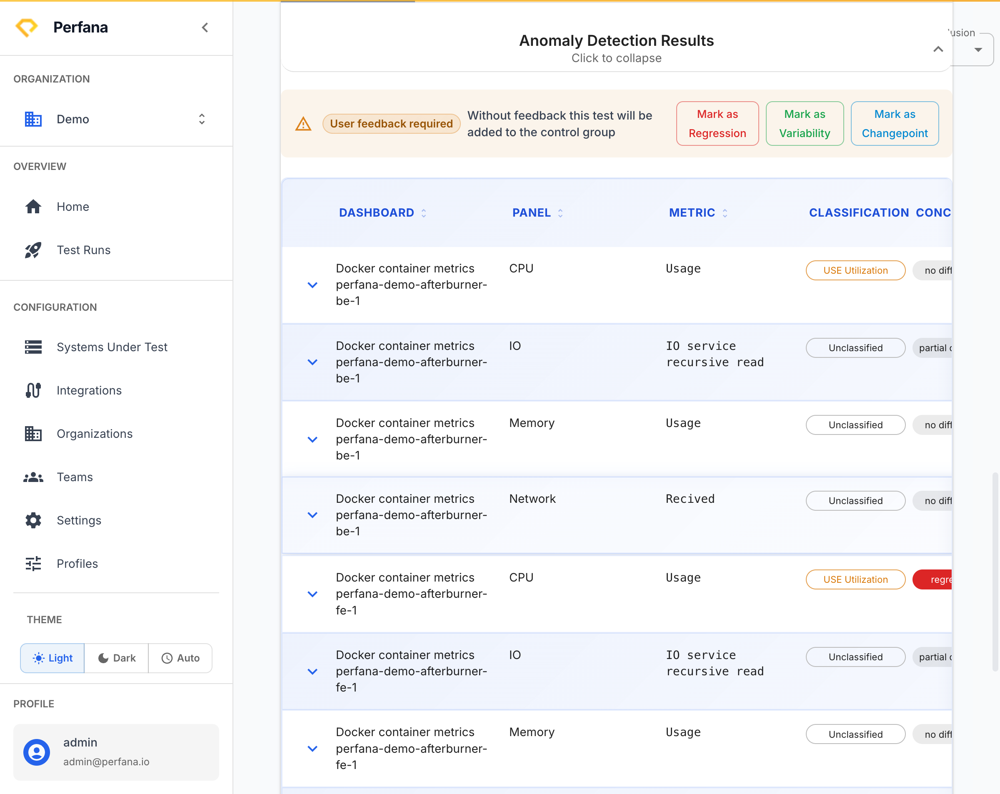

# Understand ADAPT verdicts

Read Perfana's automated regression detection (ADAPT) to see whether a run got better, worse, or stayed the same compared to a baseline of similar past runs.

**Before you start**
- You need an open test run that has been analysed. See [Read a test run](read-a-run.md).

**Steps**
1. On the test run, open the **Results** tab and go to **Anomaly Detection**.
   You see the overall verdict for the run and a per-metric list of conclusions.
   
   *Figure: Anomaly Detection - per-metric classifications and the review actions.*
2. Read each metric's label. ADAPT classifies every metric against the baseline as one of:
   - **No change** — the metric is in line with the baseline.
   - **Improvement** — the metric got better.
   - **Regression** — the metric got worse (this is what to investigate).
   - **Inconclusive** — there isn't enough signal to decide.
3. To focus, filter the list by conclusion.
   The list shows only metrics with the conclusion you chose, so you can go straight to regressions.
4. Review an anomaly and, when you've judged it, accept it.
   The anomaly is marked as reviewed so your team knows it's been looked at.

**Baselines and change points**

ADAPT compares each run against a baseline built from a control group of similar past runs. When a run reflects a deliberate, permanent performance shift (for example, after a planned change), mark it so the baseline resets from that point forward:

1. Open the run's actions menu and click **Mark as Changepoint**.
   The run is flagged as a change point, and future comparisons use the new baseline.

Use **Remove Changepoint** to undo this if you marked the wrong run.

**Result**
You can read the overall verdict and per-metric conclusions, focus on regressions, accept reviewed anomalies, and reset the baseline with a change point when a permanent shift is expected.

**Troubleshooting**
- *Everything is Inconclusive* — there may be too few comparable past runs to form a reliable baseline. Run the test more times under the same conditions.
- *A known, intended change keeps flagging as a Regression* — mark that run as a change point so the baseline resets from it.

**Related**
- [Concepts](../concepts.md)
- [ADAPT settings](../configuration/adapt-settings.md)
- [Check SLO results](slo-check-results.md)
