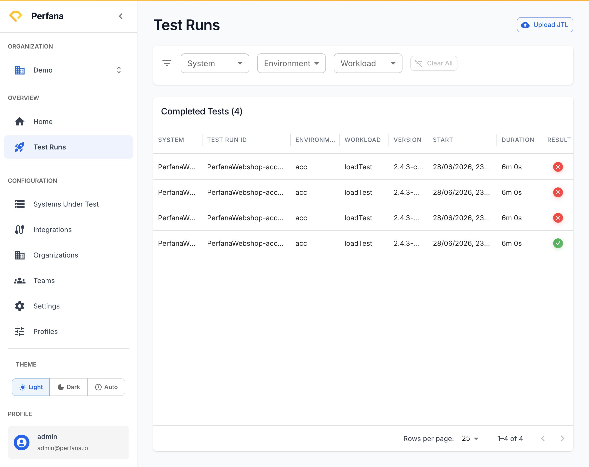
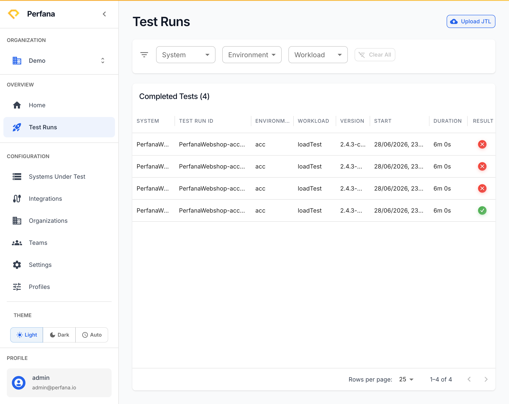

# Upload a JMeter result file

This lets you bring a JMeter `.jtl` result file into Perfana by hand, without wiring up the API. Use it for a one-off run, a quick experiment, or when you have a result file but no pipeline integration yet.

**Before you start**
- A JMeter result file in `.jtl` format.
- The system, environment, and workload this run belongs to (you choose these in the dialog).

**When to use this vs the API path**
- Use **Upload JTL** for ad-hoc, manual runs and quick checks.
- Use the API path for anything repeatable — CI pipelines and automated tests. See [Send your first test run](send-first-run.md).

**Steps**

1. Open the Test Runs list at `/test-runs`.
   You see all runs collected so far.

2. Click **Upload JTL**.
   The upload dialog opens.
   
   *Figure: the Upload JTL button on the Test Runs list.*

3. **Choose your `.jtl` file** and fill in the run details (system, environment, workload) the dialog asks for.
   The file is staged and the run details are set.
   
   *Figure: the Upload JTL dialog.*

4. **Confirm the upload.**
   Perfana ingests the file and creates a run. A new row appears on the Test Runs list.

**Result**
Your JMeter run is in Perfana. Open it from the list to see results, and Perfana analyses it just like a run sent through the API.

**Troubleshooting**
- *Upload rejected or empty results* — the file is not a valid JMeter `.jtl`, or it is missing the columns Perfana needs. Re-export from JMeter and try again.
- *Run shows no metrics from other sources* — uploading a `.jtl` brings in the load-test results only. Server-side metrics (Grafana, Dynatrace) are collected for runs sent during a live test, not for after-the-fact uploads.

**Related**
- [Send your first test run](send-first-run.md)
- [Key concepts](../concepts.md)
